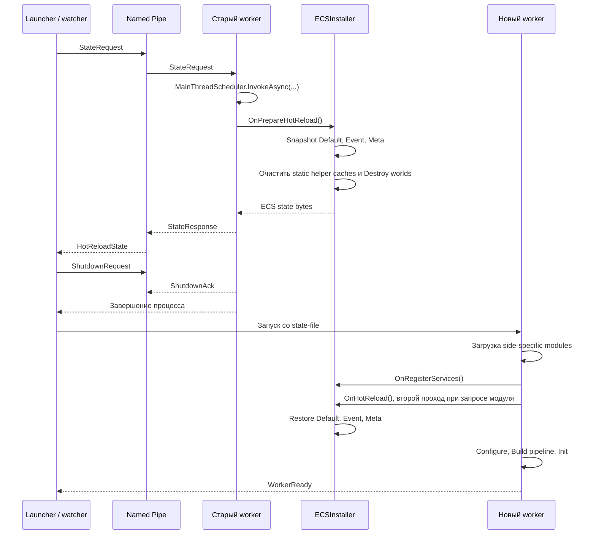

# Hot Reload

> Restart-worker hot reload в текущем ядре KarpikEngine

## Модель

Надёжный hot reload в `0.4` выполняется перезапуском worker-процесса. Launcher остаётся живым, завершает старый worker и запускает новый. Это гарантированно освобождает managed static state, фоновые задачи, подписки и native-библиотеки старого процесса.

`CoreRunner` поддерживает два режима:

| Режим | Поведение |
|-------|-----------|
| `HotReloadMode.RestartWorker` | Launcher работает как watcher и запускает `Karpik.Engine.Core.Runner` отдельным процессом |
| `HotReloadMode.Disabled` | Движок запускается напрямую в процессе launcher без hot reload |

По умолчанию Debug использует `RestartWorker`, Release использует `Disabled`. Режим можно задать через `HotReloadOptions`.

Hot reload не запускает сборку проектов. Перед reload изменённые модули должны быть собраны и скопированы в staging-директорию `modules/`.

## Граница Состояния

В `0.4` между worker-процессами сохраняются только ECS-миры:

- `DefaultWorld`;
- `EventWorld`;
- `MetaWorld`.

Состояние сериализует `ECSInstaller`. Ядро намеренно запрашивает snapshot только у этого инсталлера. `IInstallerHotReload` остаётся legacy-интерфейсом и не является разрешением сохранять произвольный object graph модулей.

Не сохраняются:

- DI-сервисы и runtime-кэши;
- сокеты, `IPeer` и сетевые соединения;
- render-ресурсы и native handles;
- physics handles;
- потоки, задачи и подписки на события;
- static-поля worker-процесса.

Если данные должны переживать reload как gameplay-состояние, они должны лежать в ECS-компонентах. Если значение существует только внутри текущего процесса, модуль должен восстановить его из ECS-данных во время обычной инициализации.

## Участники

| Участник | Ответственность |
|----------|-----------------|
| Launcher / watcher | `CoreRunner` и `ProcessManager`: держат worker-процесс, IPC server и порядок перезапуска |
| Worker | `Karpik.Engine.Core.Runner.Program`: загружает модули, выполняет loop и отвечает на IPC |
| Ядро worker | `Bootstrap` и `EngineRunner`: вызывают lifecycle инсталлеров и систем |
| ECS | `ECSInstaller`: снимает и восстанавливает snapshot трёх миров |
| Модули | Пересоздают runtime-only ресурсы обычным lifecycle-кодом |

## Порядок Reload

Reload можно запросить клавишей `R` в консоли watcher или из worker через `HotReloadHandler`. Во втором случае worker отправляет watcher сообщение `HotReloadRequest`.

Подробный порядок:

1. `ProcessManager.HotReloadAsync()` отправляет старому worker `StateRequest`.
2. `IpcClient` принимает запрос на IPC-потоке и передаёт сбор состояния в `MainThreadScheduler`.
3. На основном потоке worker вызывает `Bootstrap.GetHotReloadData()`, затем `EngineRunner.GetHotReloadData()`.
4. `EngineRunner` вызывает `ECSInstaller.OnPrepareHotReload()`.
5. `ECSInstaller` сериализует три мира, очищает ECS static helper caches и уничтожает старые worlds.
6. Worker помечает состояние собранным и прекращает loop. После snapshot ни client loop, ни server loop не должны запускать следующий tick.
7. Worker возвращает `StateResponse`. Только после успешного ответа watcher отправляет `ShutdownRequest`, ожидает завершение процесса и при необходимости завершает его принудительно.
8. Watcher записывает состояние во временный `reload/state/*.bin` и запускает новый worker с `--state-file`.
9. Новый worker загружает snapshot до старта движка, выбирает модули по `Side` и передаёт состояние в `Bootstrap.Initialize()`.
10. `EngineRunner.Setup()` сначала регистрирует сервисы модулей. Затем применяет ECS state до конфигурации модулей, построения pipeline и вызова `Init`.
11. `ECSInstaller.OnHotReload()` использует существующий двухпроходный протокол `IInstallerHotReload`: первый вызов запрашивает повторный проход, второй восстанавливает три мира.
12. После полной инициализации worker отправляет `WorkerReady`, и watcher считает запуск завершённым.

## Abort И Recovery

Если старый worker не вернул ECS snapshot за `StateRequestTimeout`, reload отменяется. Watcher не завершает старый worker. Это сохраняет текущую сессию, если ошибка произошла до разрушения ECS-миров.

Если worker подтвердил shutdown, но не завершился за `GracefulShutdownTimeout`, watcher завершает process tree принудительно.

Если worker аварийно завершился вне reload, watcher запускает новый worker без snapshot. Это crash recovery, а не сохранение gameplay-состояния.

Текущие ограничения recovery:

- `ECSInstaller.OnPrepareHotReload()` уничтожает worlds после получения snapshot, но до отправки ответа watcher. Ошибка сериализации после разрушения worlds уже не позволяет безопасно продолжить старую сессию;
- ошибки восстановления модуля логируются внутри `EngineRunner.ApplyInitialState()`, после чего startup продолжается. Для production-ready recovery восстановление должно стать fail-fast.

## Загрузка Модулей

Сборка launcher копирует outputs модулей в `modules/`. При запуске worker сгенерированный `ModuleLoader`:

1. выбирает `Shared + Client` или `Shared + Server` assemblies по `Side`;
2. копирует staging-директорию в `reload/shadow/{pid}_{guid}`;
3. проверяет наличие обязательных assemblies;
4. загружает DLL из worker-specific shadow copy.

Shadow copy позволяет следующей сборке перезаписать `modules/`, пока текущий worker ещё использует старые DLL. После завершения worker `ProcessManager` удаляет его shadow-директории.

## Контракт Модуля

Модуль, содержащий runtime-only ресурсы, должен:

- создавать их повторяемо во время обычного lifecycle;
- освобождать их в `Destroy` или полагаться на завершение worker как финальную границу очистки;
- отписываться от событий, если объект может быть уничтожен до завершения процесса;
- восстанавливать runtime handles из устойчивых ECS-данных;
- не запускать IPC, snapshot или blocking reload-операции из frame hot path.

Пример из Physics 2D:

- `PhysicsBodyDefinition` хранит устойчивое описание тела;
- `PhysicsBodyRef` хранит process-local handle;
- `Physics2DBodyRestoreSystem.Init()` удаляет восстановленные старые handles и создаёт `CreateBodyRequest` для недостающих runtime bodies.

Для клиентского соединения reconnect token хранится отдельно от `IPeer`. После перезапуска client worker новый сетевой runtime отправляет token серверу и привязывается к существующему игроку.

## Ограничения Реального Времени

IPC waits, JSON-сериализация, файловые операции, shadow copy и запуск процесса допустимы только на границе reload. Их нельзя переносить в `Begin`, `FixedUpdate`, `Update`, `LateUpdate`, `Render` или сетевой hot path.

Snapshot снимается на основном потоке worker через `MainThreadScheduler`, чтобы ECS-миры не сериализовались одновременно с изменяющими их системами.

## Связанные Документы

- [Architecture Overview](overview.md)
- [ECS](../modules/shared/ecs.md)
- [Restart-worker Hot Reload ExecPlan](../../plans/restart-worker-hot-reload-execplan.md)
