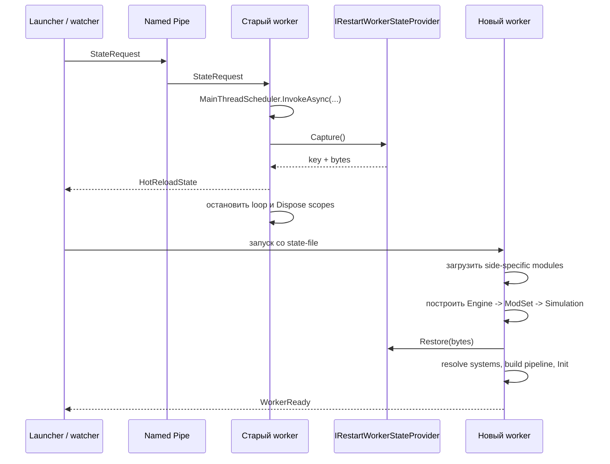

# Hot Reload

> Restart-worker hot reload в текущем ядре KarpikEngine

## Модель

Надёжный hot reload выполняется перезапуском worker-процесса. Launcher остаётся живым, получает переносимое состояние, завершает старый worker и запускает новый. Граница процесса гарантированно освобождает managed static state, фоновые задачи и native-библиотеки старого worker.

| Режим | Поведение |
|-------|-----------|
| `HotReloadMode.RestartWorker` | Launcher работает как watcher и запускает `Karpik.Engine.Core.Runner` отдельным процессом |
| `HotReloadMode.Disabled` | Движок запускается напрямую в процессе launcher |

По умолчанию Debug использует `RestartWorker`, Release — `Disabled`. Hot reload сам не собирает проекты: обновлённые модули должны быть заранее собраны и скопированы в staging-каталог `modules/`.

## Граница Состояния

Переносимое состояние предоставляют сервисы `IRestartWorkerStateProvider`, разрешённые из `Simulation` scope:

```csharp
public interface IRestartWorkerStateProvider
{
    string Key { get; }
    byte[] Capture();
    void Restore(ReadOnlySpan<byte> data);
}
```

Каждый provider обязан иметь непустой уникальный `Key`. Runner собирает результаты `Capture()` в `Dictionary<string, byte[]>`; новый worker передаёт каждому provider данные с совпадающим ключом.

Сейчас `EcsRestartWorkerStateProvider` с ключом `ECS` сохраняет три backend-мира:

- `EcsDefaultWorld`;
- `EcsEventWorld`;
- `EcsMetaWorld`.

Интерфейс расширяемый, но это не разрешение сериализовать произвольный object graph DI-контейнера. Обычно не сохраняются:

- DI-сервисы и runtime-кэши;
- сокеты, `IPeer` и сетевые соединения;
- render- и physics-handles;
- потоки, задачи и подписки;
- static-поля worker.

Gameplay-состояние, которое должно пережить restart, хранится в ECS-компонентах. Process-local ресурсы пересоздаются из устойчивых данных при обычном запуске новой Simulation.

## Участники

| Участник | Ответственность |
|----------|-----------------|
| Launcher / watcher | `CoreRunner` и `ProcessManager`: IPC, порядок остановки и запуска worker |
| Worker | `Karpik.Engine.Core.Runner.Program`: module loading, loop и ответы на IPC |
| `EngineRunner` | Разрешение state providers, `Capture`, построение scope и `Restore` |
| `EcsRestartWorkerStateProvider` | Snapshot и восстановление трёх ECS-миров |
| Остальные сервисы | Повторяемое создание и очистка через Autofac lifecycle |

## Порядок Reload

Reload можно запросить клавишей `R` в watcher или из worker через `HotReloadHandler`. Во втором случае worker отправляет launcher сообщение `HotReloadRequest`.


```mermaid
sequenceDiagram
    participant W as Launcher / watcher
    participant IPC as Named Pipe
    participant Old as Старый worker
    participant P as IRestartWorkerStateProvider
    participant New as Новый worker

    W->>IPC: StateRequest
    IPC->>Old: StateRequest
    Old->>Old: MainThreadScheduler.InvokeAsync(...)
    Old->>P: Capture()
    P-->>Old: key + bytes
    Old-->>W: HotReloadState
    Old->>Old: остановить loop и Dispose scopes
    W->>New: запуск со state-file
    New->>New: загрузить side-specific modules
    New->>New: построить Engine -> ModSet -> Simulation
    New->>P: Restore(bytes)
    New->>New: resolve systems, build pipeline, Init
    New-->>W: WorkerReady
```

Подробный порядок:

1. `ProcessManager.HotReloadAsync()` запрашивает состояние у текущего worker.
2. `IpcClient` принимает `StateRequest` и через `MainThreadScheduler` вызывает `Program.GetHotReloadState()` на основном потоке.
3. `Bootstrap.GetHotReloadData()` делегирует `EngineRunner.GetHotReloadData()`.
4. Runner разрешает все `IRestartWorkerStateProvider`, проверяет уникальность ключей и вызывает `Capture()`.
5. После успешного ответа worker прекращает loop. `Bootstrap.Shutdown()` разрушает pipeline, затем `Simulation`, `ModSet` и `Engine` scopes.
6. Launcher дожидается выхода worker, при необходимости отправляет shutdown request или завершает process tree.
7. Launcher записывает `HotReloadState` во временный state-file и запускает новый worker.
8. Новый Runner строит три DI scope и вызывает `Restore()` у provider с соответствующим ключом.
9. Восстановление завершается до разрешения систем, построения pipeline и `Init`.
10. После успешной инициализации worker отправляет `WorkerReady`.

## Abort И Recovery

Если `Capture()` выбрасывает исключение или state response не получен за `StateRequestTimeout`, worker возвращает пустой ответ, не останавливает loop, а launcher отменяет reload.

Если worker не выходит за `GracefulShutdownTimeout`, launcher сначала запрашивает shutdown, затем при необходимости завершает process tree принудительно.

Аварийный выход worker вне запланированного reload запускает новый worker без snapshot. Это crash recovery, а не сохранение gameplay-состояния.

Ошибка `Restore()` является startup-ошибкой: `EngineRunner.Setup()` освобождает уже построенные scopes и не запускает pipeline с частично восстановленным состоянием.

## Загрузка Модулей

При запуске worker сгенерированный `ModuleLoader`:

1. выбирает `Shared + Client` или `Shared + Server` assemblies по `Side`;
2. копирует staging-каталог в worker-specific shadow copy;
3. проверяет обязательные assemblies;
4. загружает DLL и передаёт их типы Runner до начала `Setup`.

После начала `Setup` добавлять модули или типы нельзя. Shadow copy позволяет сборке обновлять `modules/`, пока текущий worker использует прежние DLL.

## Контракт Runtime-Ресурсов

- Сервисы освобождают ресурсы через `IDisposable`/`IAsyncDisposable`; Autofac вызывает их при уничтожении owning scope.
- ECS-системы освобождают системные ресурсы через `ISystemDestroy`, когда разрушается pipeline.
- Event subscriptions должны быть сняты до завершения owning scope.
- Runtime handles восстанавливаются из устойчивых ECS-данных, а не переносятся между процессами.
- Конструкторы должны оставаться лёгкими; длительная инициализация выполняется в явном lifecycle вне frame hot path.

Пример Physics 2D: `PhysicsBodyDefinition` сохраняет конфигурацию тела, а `PhysicsBodyRef` содержит process-local handle. После восстановления ECS `Physics2DBodyRestoreSystem.Init()` удаляет старые handles и создаёт `CreateBodyRequest`, чтобы backend построил тела заново.

## Ограничения Реального Времени

IPC waits, сериализация, файловые операции, shadow copy и запуск процесса допустимы только на границе reload. Их нельзя переносить в `MainThreadBegin`, `Begin`, `FixedUpdate`, `Update`, `LateUpdate`, `RenderPrepare`, `Render` или сетевой hot path.

Snapshot снимается на основном потоке, чтобы ECS-миры не сериализовались одновременно с системами, которые их изменяют.

## Связанные Документы

- [Dependency Injection и области жизни](dependency-injection-and-scopes.md)
- [Architecture Overview](overview.md)
- [ECS](../modules/shared/ecs.md)
- [Restart-worker Hot Reload ExecPlan](../../plans/restart-worker-hot-reload-execplan.md)
