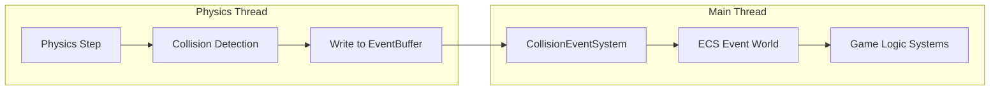
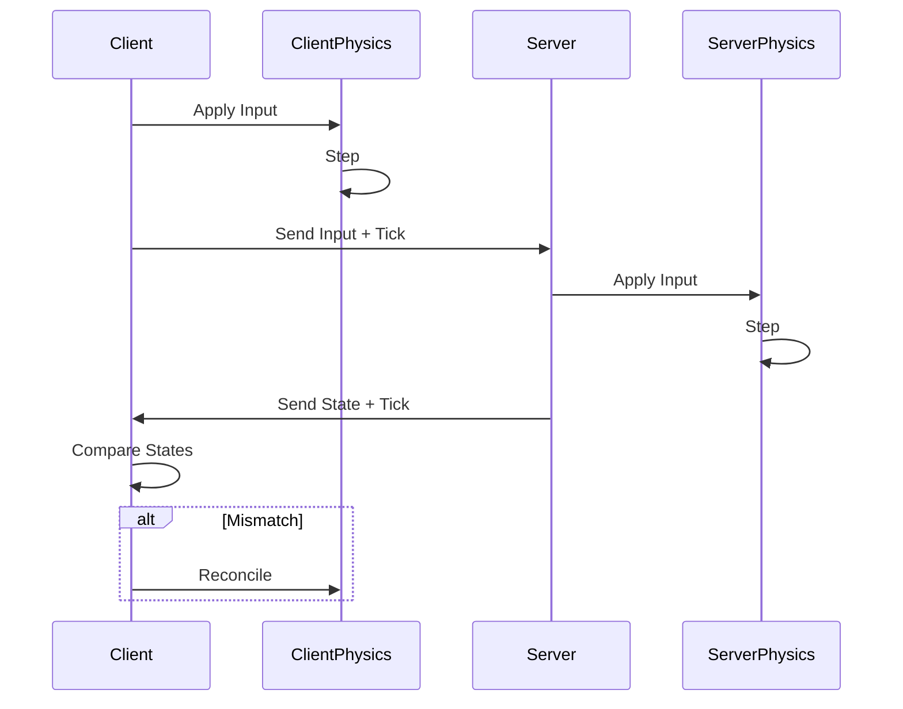

# Physics Engine Architecture Plan

> 📅 Created: 2026-02-23
> 🎯 Target: 2D Physics (Phase 1), 3D Physics (Phase 2)

## 📋 Requirements Summary

- **Architecture**: Client-Server with physics backend selection at build time
- **ECS Integration**: ID mapping between ECS entities and physics bodies
- **Network Sync**: Custom synchronization layer (future)
- **Priority**: 2D first, 3D later

---

## 🔍 Physics Engines Analysis

### 2D Physics Engines

| Engine | Language | Pros | Cons | Recommendation |
|--------|----------|------|------|----------------|
| **Aether.Physics2D** | Pure C# | Active development, .NET 9 compatible, no native deps | Slightly slower than native | ⭐ **Recommended** |
| Box2D.NET | C++ wrapper | Maximum performance | Native dependency, harder debugging | Alternative |
| VelcroPhysics | Pure C# | Fork of Farseer | Less active development | Not recommended |
| Chipmunk2D | C wrapper | Fast | Native dependency | Not recommended |

### 3D Physics Engines

| Engine | Language | Pros | Cons | Recommendation |
|--------|----------|------|------|----------------|
| **BEPU Physics v2** | Pure C# | SIMD-optimized, deterministic, no GC in hot paths | Complex API | ⭐ **Recommended** |
| Jolt Physics | C++ wrapper | Very fast, modern | Native dependency | Alternative |
| BulletSharp | C++ wrapper | Industry standard | Native dependency, older | Not recommended |
| Jitter Physics | Pure C# | Simple API | Less optimized | Alternative |

---

## 🏗️ Architecture Design

### Module Structure

```
Modules/
├── Shared/
│   └── Physics/
│       ├── Physics.Core/           # Abstractions
│       │   ├── IPhysicsWorld.cs
│       │   ├── IPhysicsBody.cs
│       │   ├── ICollider.cs
│       │   ├── Physics.Core.csproj
│       │   ├── Components/         # ECS Components
│       │   │   ├── PhysicsBody.cs
│       │   │   ├── Collider2D.cs
│       │   │   ├── Velocity.cs
│       │   │   └── PhysicsWorldId.cs
│       │   └── Systems/            # ECS Systems
│       │       ├── PhysicsStepSystem.cs
│       │       └── SyncTransformSystem.cs
│       │
│       ├── Physics.Aether2D/       # 2D Implementation
│       │   ├── AetherWorld.cs
│       │   ├── AetherBody.cs
│       │   ├── AetherModule.cs
│       │   └── Physics.Aether2D.csproj
│       │
│       └── Physics.Bepu3D/         # 3D Implementation (Future)
│           ├── BepuWorld.cs
│           ├── BepuBody.cs
│           ├── BepuModule.cs
│           └── Physics.Bepu3D.csproj
```

---

## 📐 Core Interfaces

### IPhysicsWorld

```csharp
namespace Karpik.Engine.Shared.Physics.Core;

public interface IPhysicsWorld : IDisposable
{
    /// <summary>
    /// Creates a body and returns its ID for ECS mapping
    /// </summary>
    int CreateBody(in BodyDefinition definition);
    
    /// <summary>
    /// Removes body by ID
    /// </summary>
    void RemoveBody(int bodyId);
    
    /// <summary>
    /// Steps the physics simulation
    /// </summary>
    void Step(float deltaTime);
    
    /// <summary>
    /// Gets body transform for sync with ECS
    /// </summary>
    void GetTransform(int bodyId, out Vector2 position, out float rotation);
    
    /// <summary>
    /// Sets body transform from ECS
    /// </summary>
    void SetTransform(int bodyId, Vector2 position, float rotation);
    
    /// <summary>
    /// Applies force to body
    /// </summary>
    void ApplyForce(int bodyId, Vector2 force);
    
    /// <summary>
    /// Applies impulse to body
    /// </summary>
    void ApplyImpulse(int bodyId, Vector2 impulse);
    
    /// <summary>
    /// Raycast for queries
    /// </summary>
    bool Raycast(Vector2 start, Vector2 end, out RaycastHit hit);
    
    /// <summary>
    /// Gets all bodies in area
    /// </summary>
    ReadOnlySpan<int> OverlapCircle(Vector2 center, float radius);
    
    /// <summary>
    /// Shifts all bodies by offset (Floating Origin support)
    /// Critical for large worlds to maintain float precision
    /// </summary>
    void ShiftOrigin(Vector2 offset);
    
    /// <summary>
    /// Current world origin offset (for Floating Origin)
    /// </summary>
    Vector2 OriginOffset { get; }
}

public readonly struct BodyDefinition
{
    public required BodyType Type { get; init; }  // Static, Kinematic, Dynamic
    public required Vector2 Position { get; init; }
    public float Rotation { get; init; }
    public required IColliderDefinition Collider { get; init; }
    public float Density { get; init; } = 1.0f;
    public float Friction { get; init; } = 0.5f;
    public float Restitution { get; init; } = 0.0f;
    public bool IsSensor { get; init; } = false;
}
```

### IColliderDefinition

```csharp
public interface IColliderDefinition { }

public readonly struct CircleCollider : IColliderDefinition
{
    public required float Radius { get; init; }
    public Vector2 Offset { get; init; }
}

public readonly struct BoxCollider : IColliderDefinition
{
    public required Vector2 Size { get; init; }
    public Vector2 Offset { get; init; }
}

public readonly struct PolygonCollider : IColliderDefinition
{
    public required ReadOnlyMemory<Vector2> Vertices { get; init; }
}
```

---

## 🔄 ECS Integration

### Components

```csharp
// ECS Component - stores physics world body ID
public readonly struct PhysicsBody2D : IEcsComponent
{
    public readonly int BodyId;
    public readonly int WorldId;  // For multi-world support
    
    public PhysicsBody2D(int bodyId, int worldId = 0)
    {
        BodyId = bodyId;
        WorldId = worldId;
    }
}

// Transform component (separate from physics)
public struct Transform2D : IEcsComponent
{
    public Vector2 Position;
    public float Rotation;
}

// Velocity component (can be modified by game logic)
public struct Velocity2D : IEcsComponent
{
    public Vector2 Linear;
    public float Angular;
}

// Collider reference
public readonly struct Collider2D : IEcsComponent
{
    public readonly IColliderDefinition Definition;
    public Collider2D(IColliderDefinition definition) => Definition = definition;
}
```

### Systems

```csharp
// Syncs ECS transforms TO physics world
public class SyncToPhysicsSystem : IEcsRun
{
    [EcsInject] private readonly EcsDefaultWorld _world;
    [EcsInject] private readonly IPhysicsWorld _physics;
    
    private EcsGroup _group;
    
    public void Run()
    {
        foreach (var entity in _group)
        {
            ref var transform = ref _world.GetComponent<Transform2D>(entity);
            ref var body = ref _world.GetComponent<PhysicsBody2D>(entity);
            
            // Only sync kinematic bodies from ECS
            _physics.SetTransform(body.BodyId, transform.Position, transform.Rotation);
        }
    }
}

// Syncs physics world TO ECS transforms
public class SyncFromPhysicsSystem : IEcsRun
{
    [EcsInject] private readonly EcsDefaultWorld _world;
    [EcsInject] private readonly IPhysicsWorld _physics;
    
    private EcsGroup _group;
    
    public void Run()
    {
        foreach (var entity in _group)
        {
            ref var transform = ref _world.GetComponent<Transform2D>(entity);
            ref var body = ref _world.GetComponent<PhysicsBody2D>(entity);
            
            _physics.GetTransform(body.BodyId, out transform.Position, out transform.Rotation);
        }
    }
}

// Main physics step
public class PhysicsStepSystem : IEcsRunFixed
{
    [EcsInject] private readonly IPhysicsWorld _physics;
    
    public void Run(float fixedDeltaTime)
    {
        _physics.Step(fixedDeltaTime);
    }
}
```

---

## 🌍 Large World Support (Floating Origin)

### Problem: Float Precision

At coordinates > 10,000 units from origin:
- Object jitter (vertices dance)
- Inaccurate collision detection
- Joint constraint instability

### Solution: Floating Origin

```csharp
public class FloatingOriginSystem : IEcsRun
{
    private const float THRESHOLD = 5000f;
    
    [EcsInject] private readonly IPhysicsWorld _physics;
    [EcsInject] private readonly EcsDefaultWorld _world;
    
    private Vector2 _accumulatedOffset;
    
    public void Run()
    {
        // Get reference position (player, camera, etc.)
        var playerPos = GetPlayerPosition();
        
        if (playerPos.Length() > THRESHOLD)
        {
            // Shift physics world
            _physics.ShiftOrigin(playerPos);
            
            // Track total offset for world coordinates
            _accumulatedOffset += playerPos;
            
            // Update all ECS transforms
            foreach (var entity in _movableGroup)
            {
                ref var transform = ref _world.GetComponent<Transform2D>(entity);
                transform.Position -= playerPos;
            }
        }
    }
    
    /// <summary>
    /// Converts local physics coords to world coords
    /// </summary>
    public Vector2 ToWorldCoords(Vector2 local) => local + _accumulatedOffset;
    
    /// <summary>
    /// Converts world coords to local physics coords
    /// </summary>
    public Vector2 ToLocalCoords(Vector2 world) => world - _accumulatedOffset;
}
```

### World Position Component

```csharp
/// <summary>
/// Absolute world position (survives Floating Origin shifts)
/// </summary>
public struct WorldPosition : IEcsComponent
{
    public Vector2i Sector;      // High-precision sector
    public Vector2 Local;        // Position within sector
    
    public static implicit operator WorldPosition(Vector2 local)
    {
        const float SECTOR_SIZE = 10000f;
        return new WorldPosition
        {
            Sector = new Vector2i(
                (int)MathF.Floor(local.X / SECTOR_SIZE),
                (int)MathF.Floor(local.Y / SECTOR_SIZE)
            ),
            Local = new Vector2(
                local.X % SECTOR_SIZE,
                local.Y % SECTOR_SIZE
            )
        };
    }
}
```

---

## 💥 Collision Events System

### Architecture Overview

Collision events must be **zero-allocation** in hot path and integrate with ECS event world.



### Event Types

```csharp
namespace Karpik.Engine.Shared.Physics.Core.Events;

/// <summary>
/// Base collision event - stored in ECS Event World
/// </summary>
public readonly struct CollisionEvent : IEcsComponent
{
    public readonly int BodyIdA;
    public readonly int BodyIdB;
    public readonly CollisionPhase Phase;
    public readonly Vector2 ContactPoint;
    public readonly Vector2 Normal;
    public readonly float NormalImpulse;
    
    // Entity mapping (resolved by CollisionEventSystem)
    public int EntityA => _entityMapping[BodyIdA];
    public int EntityB => _entityMapping[BodyIdB];
}

public enum CollisionPhase
{
    Enter,      // First contact
    Stay,       // Continuous contact
    Exit        // Contact ended
}

/// <summary>
/// Trigger event for sensor colliders
/// </summary>
public readonly struct TriggerEvent : IEcsComponent
{
    public readonly int TriggerBodyId;   // Sensor collider
    public readonly int OtherBodyId;     // Entering body
    public readonly CollisionPhase Phase;
}

/// <summary>
/// Contact point data for detailed collision info
/// </summary>
public readonly struct ContactPoint
{
    public readonly Vector2 Point;
    public readonly Vector2 Normal;
    public readonly float Separation;    // Negative = overlap
    public readonly float NormalImpulse;
    public readonly float TangentImpulse;
}
```

### ICollisionCallback Interface

```csharp
/// <summary>
/// Callback interface for physics engine
/// Implementation writes to event buffer (no allocations!)
/// </summary>
public interface ICollisionCallback
{
    void OnCollisionEnter(int bodyA, int bodyB, in ContactPoint contact);
    void OnCollisionStay(int bodyA, int bodyB, in ContactPoint contact);
    void OnCollisionExit(int bodyA, int bodyB);
    
    void OnTriggerEnter(int triggerBody, int otherBody);
    void OnTriggerExit(int triggerBody, int otherBody);
}
```

### Event Buffer (Lock-free for threading)

```csharp
/// <summary>
/// Lock-free ring buffer for collision events
/// Written by physics thread, read by main thread
/// </summary>
public unsafe struct CollisionEventBuffer
{
    private readonly CollisionEvent* _events;
    private readonly int _capacity;
    private int _writeIndex;
    private int _readIndex;
    
    public void Write(in CollisionEvent evt)
    {
        int index = Interlocked.Increment(ref _writeIndex) - 1;
        int slot = index % _capacity;
        _events[slot] = evt;
    }
    
    public ReadOnlySpan<CollisionEvent> ReadAll()
    {
        int written = _writeIndex;
        int count = Math.Min(written - _readIndex, _capacity);
        _readIndex = written;
        return new ReadOnlySpan<CollisionEvent>(_events, count);
    }
}
```

### ECS Integration

```csharp
/// <summary>
/// System that processes collision events and creates ECS events
/// </summary>
public class CollisionEventSystem : IEcsRun
{
    [EcsInject] private readonly EcsDefaultWorld _world;
    [EcsInject] private readonly EcsEventWorld _eventWorld;
    [EcsInject] private readonly IPhysicsWorld _physics;
    [EcsInject] private readonly IBodyToEntityMap _bodyToEntity;
    
    public void Run()
    {
        // Get events from physics buffer
        var events = _physics.GetCollisionEvents();
        
        foreach (ref readonly var evt in events)
        {
            // Create event entity in Event World
            var eventEntity = _eventWorld.NewEntity();
            _eventWorld.AddComponent(eventEntity, evt);
            
            // Add entity references for game logic
            ref var mapped = ref _eventWorld.AddComponent<MappedCollisionEvent>(eventEntity);
            mapped.EntityA = _bodyToEntity.GetEntity(evt.BodyIdA);
            mapped.EntityB = _bodyToEntity.GetEntity(evt.BodyIdB);
        }
    }
}

/// <summary>
/// Body ID to ECS Entity mapping
/// </summary>
public interface IBodyToEntityMap
{
    int GetEntity(int bodyId);
    void Register(int bodyId, int entity);
    void Unregister(int bodyId);
}
```

### Collision Filtering

```csharp
/// <summary>
/// Layer-based collision filtering
/// </summary>
public readonly struct CollisionLayer : IEcsComponent
{
    public readonly int Layer;        // 0-31
    public readonly int LayerMask;    // Which layers to collide with
    
    public static bool CanCollide(in CollisionLayer a, in CollisionLayer b)
    {
        return (a.LayerMask & (1 << b.Layer)) != 0;
    }
}

/// <summary>
/// Collision matrix configuration
/// </summary>
public class CollisionMatrix
{
    private readonly int[] _layerMasks = new int[32];
    
    public void SetLayerCollision(int layer, int mask)
    {
        _layerMasks[layer] = mask;
    }
    
    public bool CanCollide(int layerA, int layerB)
    {
        return (_layerMasks[layerA] & (1 << layerB)) != 0;
    }
}
```

### Usage Example

```csharp
// Game logic system that reacts to collisions
public class DamageOnCollisionSystem : IEcsRun
{
    [EcsInject] private readonly EcsEventWorld _events;
    
    private EcsGroup _damageables;
    private EcsGroup _projectiles;
    
    public void Run()
    {
        // Query collision events
        var filter = _events.Filter<MappedCollisionEvent>()
            .Inc<CollisionEvent>()
            .Where(e => e.Phase == CollisionPhase.Enter);
        
        foreach (var evt in filter)
        {
            ref var collision = ref _events.GetComponent<CollisionEvent>(evt);
            ref var mapped = ref _events.GetComponent<MappedCollisionEvent>(evt);
            
            // Check if projectile hit damageable
            if (_damageables.HasEntity(mapped.EntityB))
            {
                ref var health = ref _world.GetComponent<Health>(mapped.EntityB);
                health.Value -= collision.NormalImpulse * 10f;
            }
        }
    }
}
```

### Performance Notes

| Aspect | Approach | Reason |
|--------|----------|--------|
| Event storage | Native array / Span | Zero GC allocation |
| Thread safety | Lock-free ring buffer | No mutex overhead |
| Event lifetime | Single frame | Auto-cleanup via Event World |
| Filtering | Bitmask layers | O(1) collision check |

---

## 🌐 Network Sync Architecture (Future)

### State Snapshot

```csharp
public readonly struct PhysicsSnapshot
{
    public readonly int Tick;
    public readonly ReadOnlyMemory<BodyState> States;
    
    public readonly struct BodyState
    {
        public readonly int BodyId;
        public readonly Vector2 Position;
        public readonly float Rotation;
        public readonly Vector2 Velocity;
    }
}

public interface IPhysicsSync
{
    PhysicsSnapshot CreateSnapshot();
    void ApplySnapshot(in PhysicsSnapshot snapshot);
    void Serialize(in PhysicsSnapshot snapshot, IWriter writer);
    PhysicsSnapshot Deserialize(IReader reader);
}
```

### Client Prediction Flow



---

## 📊 Performance Considerations

### Memory Layout

```csharp
// GOOD: Struct-based, cache-friendly
public struct Transform2D : IEcsComponent
{
    public Vector2 Position;  // 8 bytes
    public float Rotation;    // 4 bytes
    // Total: 12 bytes, fits in cache line
}

// BAD: Reference-type, pointer chasing
public class Transform2D : IEcsComponent
{
    public Vector2 Position;
    public float Rotation;
}
```

### ID Mapping Strategy

```csharp
// Dense array for fast lookup
internal class AetherWorld : IPhysicsWorld
{
    private readonly Body[] _bodies;           // Dense array
    private readonly int[] _freeIndices;       // Free list
    private int _freeCount;
    
    public int CreateBody(in BodyDefinition definition)
    {
        int id = _freeCount > 0 
            ? _freeIndices[--_freeCount] 
            : _nextId++;
        
        _bodies[id] = CreateAetherBody(definition);
        return id;
    }
}
```

### Batch Operations

```csharp
// GOOD: Batch sync
public void SyncAllTransforms()
{
    var positions = _positionsSpan;
    var rotations = _rotationsSpan;
    var bodyIds = _bodyIdsSpan;
    
    _physics.GetTransforms(bodyIds, positions, rotations);
}

// AVOID: Per-entity sync in hot path
public void Run()
{
    foreach (var entity in _group)
    {
        _physics.GetTransform(bodyId, out pos, out rot);  // Virtual call per entity!
    }
}
```

---

## 🗺️ Implementation Phases

### Phase 1: 2D Physics Core

- [ ] Create `Physics.Core` project with interfaces
- [ ] Define ECS components: `PhysicsBody2D`, `Transform2D`, `Velocity2D`
- [ ] Implement `IPhysicsWorld` interface
- [ ] Create `Physics.Aether2D` implementation
- [ ] Implement ECS systems for sync
- [ ] Add collision events system

### Phase 2: 2D Physics Features

- [ ] Joint/constraint system
- [ ] Collision layers and filtering
- [ ] Physics debug visualization
- [ ] Area queries and raycasts
- [ ] **Floating Origin system** for large worlds

### Phase 3: Network Sync

- [ ] `IPhysicsSync` interface
- [ ] Snapshot serialization
- [ ] Client prediction / server reconciliation
- [ ] Lag compensation for hitscan

### Phase 4: 3D Physics

- [ ] Create `Physics.Bepu3D` project
- [ ] 3D versions of components
- [ ] Character controller
- [ ] Vehicle physics

---

## ⚠️ Critical Decisions

### 1. Fixed Timestep vs Variable

**Decision**: Fixed timestep for physics, variable for rendering

```csharp
public class PhysicsConfig
{
    public float FixedDeltaTime { get; } = 1f / 60f;  // 60 Hz physics
    public int MaxStepsPerFrame { get; } = 3;         // Catch up limit
}
```

### 2. Determinism

**Decision**: Deterministic physics for network sync

- Aether.Physics2D: Deterministic with fixed timestep
- BEPU v2: Fully deterministic across platforms

### 3. Thread Safety

**Decision**: Single-threaded physics with job system integration

```csharp
// Physics runs on main thread or dedicated thread
// Results are read-only for other systems
public class PhysicsStepSystem : IEcsRunFixed
{
    public void Run(float dt)
    {
        _physics.Step(dt);  // Single-threaded
    }
}
```

---

## 📦 Dependencies

```xml
<!-- Physics.Aether2D.csproj -->
<ItemGroup>
    <PackageReference Include="Aether.Physics2D" Version="2.1.0" />
</ItemGroup>

<!-- Physics.Bepu3D.csproj (future) -->
<ItemGroup>
    <PackageReference Include="BepuPhysics" Version="2.4.0" />
    <PackageReference Include="BepuUtilities" Version="2.4.0" />
</ItemGroup>
```

---

## 🔗 Related Documents

- [ECS Module Documentation](../docs/modules/shared/ecs.md)
- [Network Architecture](../docs/modules/shared/network-shared.md)
- [Performance Overview](../docs/performance/overview.md)
