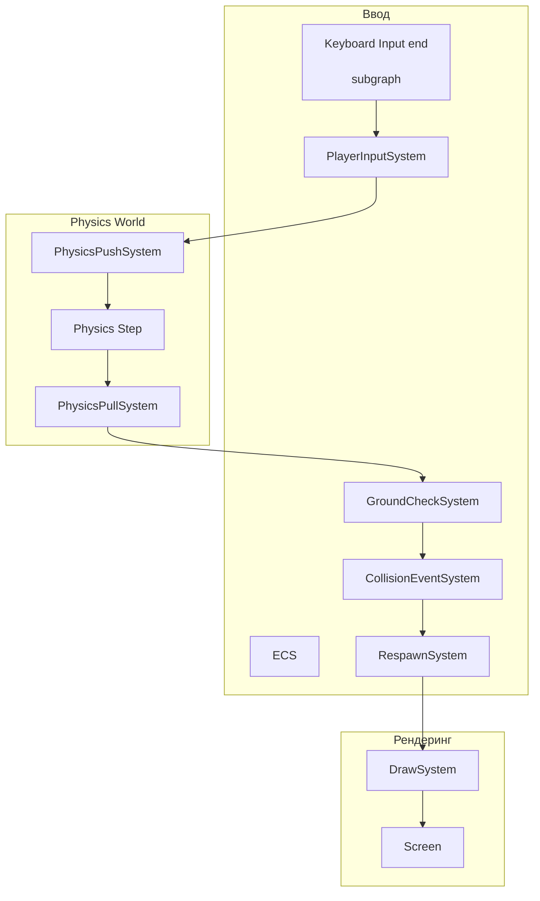

# Physics Platformer - Архитектура игры

## 1. Обзор

Демонстрационная игра типа платформер, использующая физический движок Aether Physics 2D для демонстрации возможностей движка KarpikEngine.

## 2. Геймплей

- **Управление**: WASD / стрелки для движения, SPACE для прыжка
- **Цель**: Дойти до финишной зоны
- **Механики**: Прыжки, толкание ящиков, сбор бонусов
- **Опасности**: Шипы (Death Zones)

## 3. ECS Архитектура

### 3.1 Компоненты (Shared)

```csharp
// Игрок
public struct Player : IEcsComponent { }

// Тег локального игрока (для управления)
public struct LocalPlayer : IEcsComponent { }

// Физическое тело (уже есть в Physics2D.Core)
using Karpik.Engine.Shared.Physics.Core;
public struct PhysicsBodyRef : IEcsComponent 
{
    public PhysicsBodyHandle Handle;
}

// Состояние прыжка
public struct JumpState : IEcsComponent
{
    public bool CanJump;
    public bool IsGrounded;
    public float LastJumpTime;
}

// Платформа (статическое тело)
public struct Platform : IEcsComponent 
{
    public Vector2 Size;
}

// Динамический ящик
public struct PushableBox : IEcsComponent 
{
    public float Mass;
}

// Бонус (монета)
public struct Collectible : IEcsComponent
{
    public int ScoreValue;
    public bool IsCollected;
}

// Финишная зона
public struct FinishZone : IEcsComponent { }

// Зона смерти (шипы)
public struct DeathZone : IEcsComponent { }

// Тег для респавна
public struct RespawnPoint : IEcsComponent
{
    public Vector2 Position;
}
```

### 3.2 Системы (Client-side для демо)

#### PlayerInputSystem
- Считывает ввод с клавиатуры
- Применяет силы к физическому телу игрока
- Вызывает прыжок при нажатии SPACE

#### GroundCheckSystem
- Использует Raycast вниз для проверки земли
- Обновляет компонент JumpState.IsGrounded
- Разрешает прыжок только когда на земле

#### PhysicsPullSystem
- Существует в Physics2D.Core
- Синхронизирует позицию из физического мира в ECS

#### CollisionEventSystem
- Обрабатывает события коллизий
- Detect: Collectible -> уничтожает бонус
- Detect: Player + DeathZone -> респавн
- Detect: Player + FinishZone -> победа

#### RespawnSystem
- Перемещает игрока на точку респавна
- Сбрасывает скорость

### 3.3 Aspects

```csharp
// Все физические тела
public sealed class PhysicsBodyAspect : EcsAspect
{
    public EcsPool<PhysicsBodyRef> Refs = B.IncludePool<PhysicsBodyRef>();
    public EcsPool<Transform2D> Transforms = B.IncludePool<Transform2D>();
}

// Игрок с физикой
public sealed class PlayerPhysicsAspect : EcsAspect
{
    public EcsPool<Player> Players = B.Inc;
    public EcsPool<PhysicsBodyRef> Refs = B.Inc;
    public EcsPool<JumpState> JumpStates = B.Inc;
}

// Платформы
public sealed class PlatformAspect : EcsAspect
{
    public EcsPool<Platform> Platforms = B.Inc;
    public EcsPool<Transform2D> Transforms = B.Inc;
}
```

## 4. Физические слои

| Слой | Bit | Описание |
|------|-----|----------|
| Default | 1 | Все объекты по умолчанию |
| Player | 2 | Игрок |
| Platform | 4 | Платформы и стены |
| Pushable | 8 | Толкаемые объекты |
| Collectible | 16 | Бонусы |
| Trigger | 32 | Триггерные зоны |
| Death | 64 | Смертельные зоны |

## 5. Конфигурация физики

```csharp
// Параметры игрока
PlayerConfig:
- Mass: 1.0f
- Friction: 0.3f
- Restitution: 0.0f (без отскока)
- LinearDamping: 0.0f
- JumpForce: 15.0f
- MoveSpeed: 10.0f
- MaxVelocity: 20.0f

// Параметры платформ
PlatformConfig:
- BodyType: Static
- Friction: 0.5f

// Параметры ящиков
BoxConfig:
- BodyType: Dynamic
- Mass: 0.5f
- Friction4f
- Restitution: 0.1: 0.f
```

## 6. Структура уровня

```
Level1:
├── SpawnPoint: (0, 0)
├── Platforms:
│   ├── Ground: (-10 to 10, -1), size: (20, 1)
│   ├── Platform1: (5, 2), size: (4, 0.5)
│   ├── Platform2: (10, 4), size: (4, 0.5)
│   └── Wall: (15, 0 to 5), size: (1, 5)
├── PushableBoxes:
│   └── Box1: (2, 1), size: (1, 1)
├── Collectibles:
│   ├── Coin1: (5, 3)
│   ├── Coin2: (10, 5)
│   └── Coin3: (12, 2)
├── DeathZones:
│   └── Spikes: (8, -0.5), size: (2, 0.5)
└── FinishZone:
    └── Finish: (18, 1), size: (1, 3)
```

## 7. Pipeline порядок выполнения

```
Order (по возрастанию):
├── 0. PlayerInputSystem        - Обработка ввода
├── 10. PhysicsStepSystem      - Шаг физики (Aether)
├── 20. GroundCheckSystem      - Проверка земли
├── 30. CollisionEventSystem   - Обработка событий
├── 40. RespawnSystem          - Респавн если мертв
└── 50. RenderSystem            - Отрисовка
```

## 8. Диаграмма потока данных



## 9. Файловая структура

```
MyGame/
├── Shared/MyGame.Shared.Main/
│   ├── Components/         # Игровые компоненты
│   │   ├── PlayerComponents.cs
│   │   ├── LevelComponents.cs
│   │   └── PhysicsComponents.cs
│   └── Systems/           # Общие системы
├── Client/MyGame.Client.Main/
│   ├── PlatformerModule.cs    # Модуль платформера
│   ├── Systems/
│   │   ├── PlayerInputSystem.cs
│   │   ├── GroundCheckSystem.cs
│   │   ├── CollisionEventSystem.cs
│   │   └── RespawnSystem.cs
│   ├── Levels/
│   │   └── Level1.cs          # Уровень
│   └── Prefabs/
│       ├── PlayerPrefab.cs
│       ├── PlatformPrefab.cs
│       └── BoxPrefab.cs
```

## 10. Критические решения

### 10.1 Single-player или Multiplayer?

Для демонстрации физики лучше сделать **single-player** режим, чтобы не усложнять синхронизацию физики между клиентами.

### 10.2 Client-side или Server-side физика?

Для демо: **Client-side физика** с сервером только для событий (сбор бонусов, смерть).

### 10.3 Визуализация

Использовать существующий `Drawer` из MyGame с простыми примитивами:
- Игрок: зеленый квадрат
- Платформы: серые прямоугольники
- Ящики: коричневые квадраты
- Бонусы: желтые круги
- Шипы: красные треугольники
- Финиш: синий прямоугольник

## 11. TODO

- [ ] Создать компоненты Player, Platform, Collectible и т.д.
- [ ] Реализовать PlayerInputSystem
- [ ] Реализовать GroundCheckSystem (Raycast)
- [ ] Реализовать CollisionEventSystem
- [ ] Реализовать RespawnSystem
- [ ] Создать Level1 с платформами и объектами
- [ ] Подключить к DemoModuleClient
- [ ] Протестировать физику
