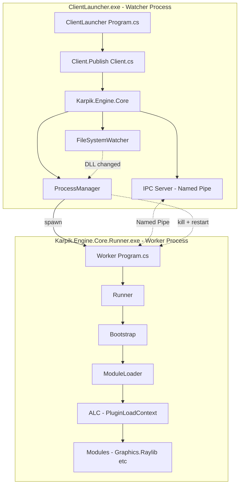
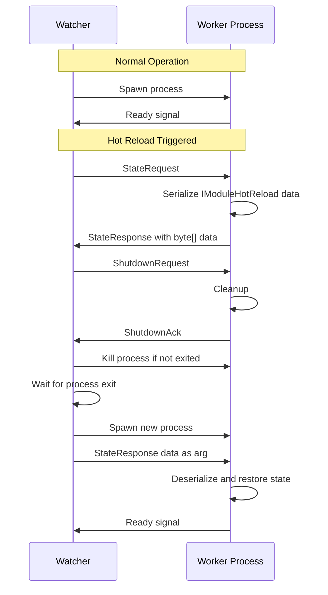
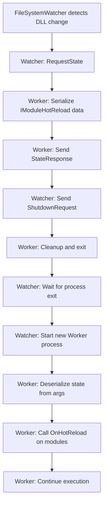

# Process Isolation Architecture for Native DLL Unloading

## Problem Statement

`AssemblyLoadContext.Unload()` only unloads **managed assemblies**, not **native DLLs** (Raylib, ImGui). Native libraries are loaded at the OS process level and remain in memory until the process terminates. This prevents true hot reload when native libraries are involved.

## Solution: Process Isolation (Watcher Pattern)

Convert the architecture from single-process to two-process model:

```
┌─────────────────────────────────────────────────────────────────┐
│  ClientLauncher.exe (Watcher Process)                           │
│  - Thin, never reloads                                          │
│  - References Karpik.Engine.Client.Publish                      │
│  - Spawns Karpik.Engine.Core.Runner.exe                         │
│  - Monitors for hot reload requests via FileSystemWatcher       │
│  - Kills and restarts worker process on hot reload              │
│  - Preserves state via IPC serialization                         │
└─────────────────────────────────────────────────────────────────┘
                           │
                           │ Process spawn + IPC (Named Pipes)
                           ▼
┌─────────────────────────────────────────────────────────────────┐
│  Karpik.Engine.Core.Runner.exe (Worker Process)                 │
│  - Loads modules via ALC                                        │
│  - Runs Raylib/ImGui                                            │
│  - Can be killed and restarted cleanly                          │
│  - All native DLLs unloaded on process exit                     │
│  - Serializes state before shutdown                             │
└─────────────────────────────────────────────────────────────────┘
```

## Architecture Diagram



## IPC Mechanism: Named Pipes

**Why Named Pipes?**
- Low latency on Windows (uses shared memory)
- Built-in .NET support (`System.IO.Pipes`)
- Bidirectional communication
- No port conflicts (unlike TCP)
- Works on Windows/Linux/macOS

**Protocol Design:**

```
┌─────────────────────────────────────────────────────────────┐
│ Message Format (Binary)                                     │
├─────────────────────────────────────────────────────────────┤
│ [4 bytes] Message Length (excluding this header)            │
│ [1 byte]  Message Type                                      │
│ [N bytes] Payload                                           │
└─────────────────────────────────────────────────────────────┘

Message Types:
- 0x01: PingRequest
- 0x02: PingResponse
- 0x10: StateRequest (Watcher asks Worker for state)
- 0x11: StateResponse (Worker sends serialized state)
- 0x20: ShutdownRequest (Watcher asks Worker to shutdown gracefully)
- 0x21: ShutdownAck (Worker acknowledges shutdown)
- 0x30: HotReloadPrepare (Worker prepares for hot reload)
- 0x31: HotReloadReady (Worker ready to be killed)
└─────────────────────────────────────────────────────────────┘
```

## State Serialization Protocol

For hot reload to work across process boundaries, we need to serialize game state:



**State Data Structure:**

```csharp
// In Karpik.Engine.Core
public class HotReloadState
{
    public Dictionary<string, byte[]> ModuleStates { get; set; } = new();
    public long Timestamp { get; set; }
}

// Each module implements:
public interface IModuleHotReload
{
    byte[] OnPrepareHotReload();  // Serialize state
    bool OnHotReload(byte[] data, IServiceContainer services);  // Deserialize
}
```

## Project Structure Changes

### 1. Karpik.Engine.Core.Runner.csproj

**Before:**
```xml
<Project Sdk="Microsoft.NET.Sdk">
    <PropertyGroup>
        <TargetFramework>net10.0</TargetFramework>
        <!-- Library, not exe -->
    </PropertyGroup>
</Project>
```

**After:**
```xml
<Project Sdk="Microsoft.NET.Sdk">
    <PropertyGroup>
        <OutputType>Exe</OutputType>
        <TargetFramework>net10.0</TargetFramework>
        <!-- Worker process exe -->
    </PropertyGroup>
    
    <!-- Native DLLs will be copied here -->
    <Import Project="..\Plugins.targets" />
</Project>
```

### 2. New Files

| File | Purpose |
|------|---------|
| `Karpik.Engine.Core/ProcessManagement/ProcessManager.cs` | Spawns, monitors, kills worker process |
| `Karpik.Engine.Core/ProcessManagement/IpcServer.cs` | Named pipe server in watcher |
| `Karpik.Engine.Core/ProcessManagement/IpcClient.cs` | Named pipe client in worker |
| `Karpik.Engine.Core/ProcessManagement/HotReloadState.cs` | State container for IPC |
| `Karpik.Engine.Core.Runner/Program.cs` | Entry point for worker process |
| `Karpik.Engine.Core.Runner/WorkerEntryPoint.cs` | Worker initialization logic |

### 3. Modified Files

| File | Changes |
|------|---------|
| `Karpik.Engine.Core/Bootstrap.cs` | Remove ALC unload logic, add IPC integration |
| `Karpik.Engine.Client.Publish/Client.cs` | Use ProcessManager instead of direct Bootstrap |
| `ClientLauncher/Program.cs` | Minimal changes, just entry point |
| `Generated/ModuleLoader.cs` | Simplify - no ALC unload needed in worker |

## Implementation Details

### ProcessManager (Watcher Side)

```csharp
public class ProcessManager : IDisposable
{
    private Process? _workerProcess;
    private IpcServer _ipcServer;
    private readonly string _workerExePath;
    private HotReloadState? _pendingState;
    
    public event Action<HotReloadState?>? OnWorkerReady;
    
    public async Task StartWorker(HotReloadState? initialState = null)
    {
        var args = initialState != null 
            ? $"--state={Convert.ToBase64String(SerializeState(initialState))}"
            : "";
            
        _workerProcess = new Process
        {
            StartInfo = new ProcessStartInfo
            {
                FileName = _workerExePath,
                Arguments = args,
                UseShellExecute = false,
                CreateNoWindow = false
            }
        };
        
        _workerProcess.Start();
        await _ipcServer.WaitForConnectionAsync();
    }
    
    public async Task<HotReloadState> RequestStateAndShutdown()
    {
        var state = await _ipcServer.RequestStateAsync();
        await _ipcServer.SendShutdownRequestAsync();
        await _workerProcess.WaitForExitAsync();
        return state;
    }
    
    public async Task HotReload()
    {
        var state = await RequestStateAndShutdown();
        await StartWorker(state);
    }
}
```

### Worker Entry Point

```csharp
// Karpik.Engine.Core.Runner/Program.cs
public class Program
{
    public static async Task Main(string[] args)
    {
        var stateArg = ParseStateArg(args);
        var ipcClient = new IpcClient();
        await ipcClient.ConnectAsync();
        
        var bootstrap = new Bootstrap();
        bootstrap.Initialize(stateArg, ipcClient);
        
        // Main loop
        while (bootstrap.IsRunning)
        {
            bootstrap.Loop(GetDeltaTime());
            await ipcClient.ProcessMessagesAsync(bootstrap);
        }
        
        bootstrap.Shutdown();
    }
}
```

## Hot Reload Flow



## Benefits

1. **Complete Native Cleanup** - OS reclaims all resources when process dies
2. **No Memory Leaks** - Fresh process = clean slate
3. **Crash Isolation** - Engine crashes don't kill the watcher
4. **True Hot Reload** - Can update native DLLs between restarts
5. **Debugging Friendly** - Can attach debugger to worker process

## Trade-offs

1. **State Serialization Overhead** - Must serialize/deserialize game state
2. **IPC Latency** - Small delay for communication (negligible with named pipes)
3. **Complexity** - More moving parts than single-process
4. **Window Flash** - Brief window disappearance during restart (can be mitigated)

## Migration Path

### Phase 1: Infrastructure
1. Convert `Karpik.Engine.Core.Runner` to exe
2. Add `Program.cs` entry point
3. Implement IPC infrastructure (Named Pipes)
4. Implement `ProcessManager`

### Phase 2: Integration
1. Modify `Client.cs` to use `ProcessManager`
2. Remove ALC unload logic from `Bootstrap.cs`
3. Add state serialization to modules

### Phase 3: Polish
1. Handle edge cases (worker crash, timeout)
2. Add graceful shutdown protocol
3. Optimize state serialization performance
4. Add debugging support

## Questions for Clarification

1. **State Size**: What is the typical size of hot reload state data? (affects serialization strategy)
2. **Window Handling**: Should the game window persist across reloads (requires window ownership tricks)?
3. **Crash Recovery**: Should the watcher auto-restart crashed workers?
4. **Debugging**: Do you need to support attaching debugger to worker process automatically?
