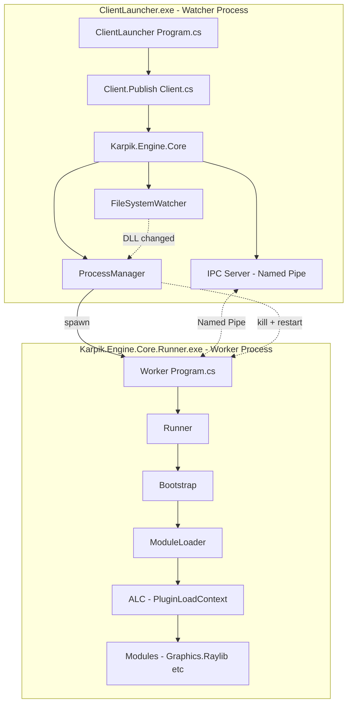
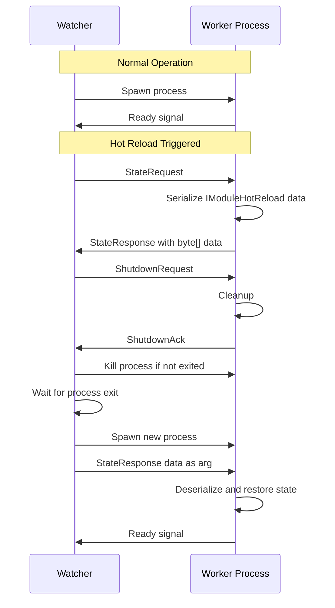
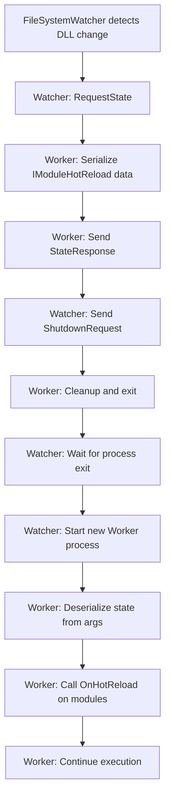

# Process Isolation Architecture for Native DLL Unloading

## Problem Statement

`AssemblyLoadContext.Unload()` only unloads **managed assemblies**, not **native DLLs** (Raylib, ImGui). Native libraries are loaded at the OS process level and remain in memory until the process terminates. This prevents true hot reload when native libraries are involved.

## Solution: Process Isolation (Watcher Pattern)

Convert the architecture from single-process to two-process model:

```
┌─────────────────────────────────────────────────────────────────┐
│  ClientLauncher.exe (Watcher Process)                           │
│  - Thin, never reloads                                          │
│  - References Karpik.Engine.Client.Publish                      │
│  - Spawns Karpik.Engine.Core.Runner.exe                         │
│  - Monitors for hot reload requests via FileSystemWatcher       │
│  - Kills and restarts worker process on hot reload              │
│  - Preserves state via IPC serialization                         │
└─────────────────────────────────────────────────────────────────┘
                           │
                           │ Process spawn + IPC (Named Pipes)
                           ▼
┌─────────────────────────────────────────────────────────────────┐
│  Karpik.Engine.Core.Runner.exe (Worker Process)                 │
│  - Loads modules via ALC                                        │
│  - Runs Raylib/ImGui                                            │
│  - Can be killed and restarted cleanly                          │
│  - All native DLLs unloaded on process exit                     │
│  - Serializes state before shutdown                             │
└─────────────────────────────────────────────────────────────────┘
```

## Architecture Diagram



## IPC Mechanism: Named Pipes

**Why Named Pipes?**
- Low latency on Windows (uses shared memory)
- Built-in .NET support (`System.IO.Pipes`)
- Bidirectional communication
- No port conflicts (unlike TCP)
- Works on Windows/Linux/macOS

**Protocol Design:**

```
┌─────────────────────────────────────────────────────────────┐
│ Message Format (Binary)                                     │
├─────────────────────────────────────────────────────────────┤
│ [4 bytes] Message Length (excluding this header)            │
│ [1 byte]  Message Type                                      │
│ [N bytes] Payload                                           │
└─────────────────────────────────────────────────────────────┘

Message Types:
- 0x01: PingRequest
- 0x02: PingResponse
- 0x10: StateRequest (Watcher asks Worker for state)
- 0x11: StateResponse (Worker sends serialized state)
- 0x20: ShutdownRequest (Watcher asks Worker to shutdown gracefully)
- 0x21: ShutdownAck (Worker acknowledges shutdown)
- 0x30: HotReloadPrepare (Worker prepares for hot reload)
- 0x31: HotReloadReady (Worker ready to be killed)
└─────────────────────────────────────────────────────────────┘
```

## State Serialization Protocol

For hot reload to work across process boundaries, we need to serialize game state:



**State Data Structure:**

```csharp
// In Karpik.Engine.Core
public class HotReloadState
{
    public Dictionary<string, byte[]> ModuleStates { get; set; } = new();
    public long Timestamp { get; set; }
}

// Each module implements:
public interface IModuleHotReload
{
    byte[] OnPrepareHotReload();  // Serialize state
    bool OnHotReload(byte[] data, IServiceContainer services);  // Deserialize
}
```

## Project Structure Changes

### 1. Karpik.Engine.Core.Runner.csproj

**Before:**
```xml
<Project Sdk="Microsoft.NET.Sdk">
    <PropertyGroup>
        <TargetFramework>net10.0</TargetFramework>
        <!-- Library, not exe -->
    </PropertyGroup>
</Project>
```

**After:**
```xml
<Project Sdk="Microsoft.NET.Sdk">
    <PropertyGroup>
        <OutputType>Exe</OutputType>
        <TargetFramework>net10.0</TargetFramework>
        <!-- Worker process exe -->
    </PropertyGroup>
    
    <!-- Native DLLs will be copied here -->
    <Import Project="..\Plugins.targets" />
</Project>
```

### 2. New Files

| File | Purpose |
|------|---------|
| `Karpik.Engine.Core/ProcessManagement/ProcessManager.cs` | Spawns, monitors, kills worker process |
| `Karpik.Engine.Core/ProcessManagement/IpcServer.cs` | Named pipe server in watcher |
| `Karpik.Engine.Core/ProcessManagement/IpcClient.cs` | Named pipe client in worker |
| `Karpik.Engine.Core/ProcessManagement/HotReloadState.cs` | State container for IPC |
| `Karpik.Engine.Core.Runner/Program.cs` | Entry point for worker process |
| `Karpik.Engine.Core.Runner/WorkerEntryPoint.cs` | Worker initialization logic |

### 3. Modified Files

| File | Changes |
|------|---------|
| `Karpik.Engine.Core/Bootstrap.cs` | Remove ALC unload logic, add IPC integration |
| `Karpik.Engine.Client.Publish/Client.cs` | Use ProcessManager instead of direct Bootstrap |
| `ClientLauncher/Program.cs` | Minimal changes, just entry point |
| `Generated/ModuleLoader.cs` | Simplify - no ALC unload needed in worker |

## Implementation Details

### ProcessManager (Watcher Side)

```csharp
public class ProcessManager : IDisposable
{
    private Process? _workerProcess;
    private IpcServer _ipcServer;
    private readonly string _workerExePath;
    private HotReloadState? _pendingState;
    
    public event Action<HotReloadState?>? OnWorkerReady;
    
    public async Task StartWorker(HotReloadState? initialState = null)
    {
        var args = initialState != null 
            ? $"--state={Convert.ToBase64String(SerializeState(initialState))}"
            : "";
            
        _workerProcess = new Process
        {
            StartInfo = new ProcessStartInfo
            {
                FileName = _workerExePath,
                Arguments = args,
                UseShellExecute = false,
                CreateNoWindow = false
            }
        };
        
        _workerProcess.Start();
        await _ipcServer.WaitForConnectionAsync();
    }
    
    public async Task<HotReloadState> RequestStateAndShutdown()
    {
        var state = await _ipcServer.RequestStateAsync();
        await _ipcServer.SendShutdownRequestAsync();
        await _workerProcess.WaitForExitAsync();
        return state;
    }
    
    public async Task HotReload()
    {
        var state = await RequestStateAndShutdown();
        await StartWorker(state);
    }
}
```

### Worker Entry Point

```csharp
// Karpik.Engine.Core.Runner/Program.cs
public class Program
{
    public static async Task Main(string[] args)
    {
        var stateArg = ParseStateArg(args);
        var ipcClient = new IpcClient();
        await ipcClient.ConnectAsync();
        
        var bootstrap = new Bootstrap();
        bootstrap.Initialize(stateArg, ipcClient);
        
        // Main loop
        while (bootstrap.IsRunning)
        {
            bootstrap.Loop(GetDeltaTime());
            await ipcClient.ProcessMessagesAsync(bootstrap);
        }
        
        bootstrap.Shutdown();
    }
}
```

## Hot Reload Flow



## Benefits

1. **Complete Native Cleanup** - OS reclaims all resources when process dies
2. **No Memory Leaks** - Fresh process = clean slate
3. **Crash Isolation** - Engine crashes don't kill the watcher
4. **True Hot Reload** - Can update native DLLs between restarts
5. **Debugging Friendly** - Can attach debugger to worker process

## Trade-offs

1. **State Serialization Overhead** - Must serialize/deserialize game state
2. **IPC Latency** - Small delay for communication (negligible with named pipes)
3. **Complexity** - More moving parts than single-process
4. **Window Flash** - Brief window disappearance during restart (can be mitigated)

## Migration Path

### Phase 1: Infrastructure
1. Convert `Karpik.Engine.Core.Runner` to exe
2. Add `Program.cs` entry point
3. Implement IPC infrastructure (Named Pipes)
4. Implement `ProcessManager`

### Phase 2: Integration
1. Modify `Client.cs` to use `ProcessManager`
2. Remove ALC unload logic from `Bootstrap.cs`
3. Add state serialization to modules

### Phase 3: Polish
1. Handle edge cases (worker crash, timeout)
2. Add graceful shutdown protocol
3. Optimize state serialization performance
4. Add debugging support

## Implementation Status

### ✅ Completed

All core infrastructure has been implemented:

| Component | File | Status |
|-----------|------|--------|
| IPC Protocol | `Karpik.Engine.Core/ProcessManagement/IpcProtocol.cs` | ✅ Done |
| IPC Server (Watcher) | `Karpik.Engine.Core/ProcessManagement/IpcServer.cs` | ✅ Done |
| IPC Client (Worker) | `Karpik.Engine.Core/ProcessManagement/IpcClient.cs` | ✅ Done |
| Process Manager | `Karpik.Engine.Core/ProcessManagement/ProcessManager.cs` | ✅ Done |
| Worker Entry Point | `Karpik.Engine.Core.Runner/Program.cs` | ✅ Done |
| Engine Runner | `Karpik.Engine.Core.Runner/Runner.cs` | ✅ Done |
| Bootstrap (simplified) | `Karpik.Engine.Core/Bootstrap.cs` | ✅ Done |
| Client Integration | `Karpik.Engine.Client.Publish/Client.cs` | ✅ Done |
| Server Integration | `Karpik.Engine.Server.Publish/Server.cs` | ✅ Done |
| Debugging Support | Auto-attach when Watcher debugged | ✅ Done |

---

## Как работает Hot Reload

### Общий принцип

Hot Reload реализован через **перезапуск процесса** (Process Isolation). Это единственный надежный способ выгрузить native DLL (Raylib, ImGui) - операционная система автоматически освобождает все ресурсы при завершении процесса.

### Последовательность Hot Reload

```
┌─────────────────────────────────────────────────────────────────────────────┐
│ 1. DETECT CHANGE                                                             │
│    FileSystemWatcher обнаруживает изменение DLL                              │
└─────────────────────────────────────────────────────────────────────────────┘
                                    │
                                    ▼
┌─────────────────────────────────────────────────────────────────────────────┐
│ 2. REQUEST STATE                                                             │
│    Watcher → Worker: "Дай мне своё состояние для сохранения"                │
│    Worker вызывает IModuleHotReload.OnPrepareHotReload() на всех модулях    │
│    Worker → Watcher: StateResponse с сериализованным состоянием             │
└─────────────────────────────────────────────────────────────────────────────┘
                                    │
                                    ▼
┌─────────────────────────────────────────────────────────────────────────────┐
│ 3. GRACEFUL SHUTDOWN                                                         │
│    Watcher → Worker: "Завершай работу"                                       │
│    Worker очищает ресурсы и выходит                                          │
│    ОС освобождает ВСЕ native DLL (Raylib, ImGui, etc.)                      │
└─────────────────────────────────────────────────────────────────────────────┘
                                    │
                                    ▼
┌─────────────────────────────────────────────────────────────────────────────┐
│ 4. RESTART WITH STATE                                                        │
│    Watcher запускает новый Worker процесс                                    │
│    Передаёт сохранённое состояние через IPC                                  │
│    Worker вызывает IModuleHotReload.OnHotReload(data) на модулях            │
└─────────────────────────────────────────────────────────────────────────────┘
                                    │
                                    ▼
┌─────────────────────────────────────────────────────────────────────────────┐
│ 5. CONTINUE EXECUTION                                                        │
│    Worker продолжает работу с восстановленным состоянием                     │
│    Загружены новые версии DLL                                                │
└─────────────────────────────────────────────────────────────────────────────┘
```

### Код: Сериализация состояния (Worker side)

```csharp
// Program.cs - GetHotReloadState()
private static HotReloadState? GetHotReloadState(Bootstrap bootstrap)
{
    var state = new HotReloadState();
    
    // Собираем состояние от всех модулей, поддерживающих IModuleHotReload
    foreach (var module in bootstrap.GetModules())
    {
        if (module is IModuleHotReload hotReloadable)
        {
            var moduleState = hotReloadable.OnPrepareHotReload();
            if (moduleState != null)
            {
                state.ModuleStates[module.GetType().FullName!] = moduleState;
            }
        }
    }
    
    return state.ModuleStates.Count > 0 ? state : null;
}
```

### Код: Восстановление состояния (Worker side)

```csharp
// Program.cs - ApplyHotReloadState()
private static void ApplyHotReloadState(Bootstrap bootstrap, HotReloadState state)
{
    foreach (var module in bootstrap.GetModules())
    {
        if (module is IModuleHotReload hotReloadable)
        {
            var moduleTypeName = module.GetType().FullName!;
            if (state.ModuleStates.TryGetValue(moduleTypeName, out var moduleState))
            {
                hotReloadable.OnHotReload(moduleState, bootstrap.Services);
            }
        }
    }
}
```

---

## Как работает загрузка модулей

### При старте Worker процесса

```
Program.Main()
    │
    ├── Парсинг аргументов командной строки
    │   ├── --pipe-name=xxx (имя named pipe для IPC)
    │   ├── --wait-for-debugger (ждать подключения отладчика)
    │   └── --state=base64... (сохранённое состояние при hot reload)
    │
    ├── Подключение к IPC (IpcClient.ConnectAsync)
    │
    ├── Создание Bootstrap
    │   │
    │   ├── Bootstrap.RegisterTypes()
    │   │   Регистрация сервисов в IServiceContainer
    │   │
    │   └── Bootstrap.LoadModules()
    │       │
    │       ├── Загрузка сборок через ModuleLoader
    │       │   - Чтение DLL из папки Modules/
    │       │   - Создание PluginLoadContext для изоляции
    │       │
    │       ├── Поиск типов, реализующих IModule
    │       │   - Через reflection в загруженных сборках
    │       │
    │       └── Создание и инициализация модулей
    │           - Вызов IModule.Initialize(services)
    │
    ├── Применение Hot Reload состояния (если есть)
    │   ApplyHotReloadState(bootstrap, state)
    │
    └── Запуск главного цикла
        while (running)
        {
            bootstrap.Loop(deltaTime);
            ipcClient.ProcessMessages();
        }
```

### ModuleLoader и PluginLoadContext

```csharp
// ModuleLoader загружает сборки в изолированный контекст
public class PluginLoadContext : AssemblyLoadContext
{
    private readonly AssemblyDependencyResolver _resolver;
    
    protected override Assembly? Load(AssemblyName assemblyName)
    {
        // Разрешение зависимостей из папки модуля
        var path = _resolver.ResolveAssemblyToPath(assemblyName);
        return path != null ? LoadFromAssemblyPath(path) : null;
    }
    
    protected override IntPtr LoadUnmanagedDll(string unmanagedDllName)
    {
        // Разрешение native DLL (Raylib, ImGui)
        var path = _resolver.ResolveUnmanagedDllToPath(unmanagedDllName);
        return path != null ? LoadUnmanagedDllFromPath(path) : IntPtr.Zero;
    }
}
```

---

## Отладка (Debugging)

### Способ 1: Standalone режим (отладка только Worker)

Запустите `Karpik.Engine.Core.Runner` напрямую из IDE:

1. В Rider: выберите профиль "Karpik.Engine.Core.Runner"
2. F5 для запуска с отладкой
3. Worker запустится без Watcher, в standalone режиме

**Плюсы**: Прямая отладка, нет лишних процессов
**Минусы**: Нет hot reload, нет IPC

### Способ 2: Через Watcher (полная архитектура)

1. Включите в Rider: **Settings → Build, Execution, Deployment → Debugger → Auto Attach to Child Processes**
2. Запустите `ClientLauncher` с отладкой (F5)
3. Rider автоматически подключится к Worker процессу

**Альтернативно** (без Auto Attach):
1. Запустите `ClientLauncher` с отладкой
2. Worker выведет в консоль: `[Worker] Process ID: 12345`
3. В Rider: **Run → Attach to Process** → выберите процесс Worker

### Код поддержки отладки

```csharp
// ProcessManager.cs - Watcher side
public ProcessManager(string? workerExePath = null, string? pipeName = null, 
                      bool autoAttachDebugger = true)
{
    _autoAttachDebugger = autoAttachDebugger;
    // ...
}

private ProcessStartInfo BuildStartInfo(bool waitForDebugger)
{
    var args = $"--pipe-name={_pipeName}";
    if (waitForDebugger)
    {
        args += " --wait-for-debugger";
    }
    // ...
}

// При запуске Worker:
var shouldWaitForDebugger = _autoAttachDebugger && Debugger.IsAttached;
// Если Watcher под отладкой, Worker будет ждать подключения

// Program.cs - Worker side
if (waitForDebugger)
{
    Console.WriteLine("[Worker] Waiting for debugger to attach...");
    Console.WriteLine($"[Worker] Process ID: {Environment.ProcessId}");
    while (!Debugger.IsAttached) { Thread.Sleep(100); }
    Console.WriteLine("[Worker] Debugger attached!");
}
```

---

## IModuleHotReload Interface

Модули, которые хотят сохранять состояние при hot reload, должны реализовать этот интерфейс:

```csharp
public interface IModuleHotReload
{
    /// <summary>
    /// Called before hot reload. Serialize module state to byte[].
    /// </summary>
    byte[] OnPrepareHotReload();
    
    /// <summary>
    /// Called after hot reload with new process. Restore state from byte[].
    /// </summary>
    bool OnHotReload(byte[] data, IServiceContainer services);
}
```

### Пример реализации

```csharp
public class GameLogicModule : IModule, IModuleHotReload
{
    private GameState _state;
    
    public byte[] OnPrepareHotReload()
    {
        // Сериализуем состояние игры
        return JsonSerializer.SerializeToUtf8Bytes(_state);
    }
    
    public bool OnHotReload(byte[] data, IServiceContainer services)
    {
        // Восстанавливаем состояние
        _state = JsonSerializer.Deserialize<GameState>(data);
        return true;
    }
    
    public void Initialize(IServiceContainer services)
    {
        // Инициализация модуля
    }
}
```

---

## IPC Protocol Details

### Message Types

| Code | Type | Direction | Description |
|------|------|-----------|-------------|
| 0x01 | PingRequest | Both | Keepalive ping |
| 0x02 | PingResponse | Both | Keepalive response |
| 0x10 | StateRequest | Watcher→Worker | Request hot reload state |
| 0x11 | StateResponse | Worker→Watcher | Serialized state data |
| 0x20 | ShutdownRequest | Watcher→Worker | Graceful shutdown |
| 0x21 | ShutdownAck | Worker→Watcher | Acknowledge shutdown |
| 0x30 | HotReloadRequest | Watcher→Worker | Prepare for hot reload |
| 0x40 | WorkerReady | Worker→Watcher | Worker initialized and ready |

### Binary Format

```
┌─────────────────────────────────────────────────────────────┐
│ [4 bytes] Message Length (little-endian, excludes header)   │
│ [1 byte]  Message Type                                      │
│ [N bytes] Payload (JSON or binary depending on type)        │
└─────────────────────────────────────────────────────────────┘
```

---

## Преимущества архитектуры

1. **Полная выгрузка Native DLL** - ОС освобождает все ресурсы при завершении процесса
2. **Нет утечек памяти** - Новый процесс = чистое состояние
3. **Изоляция крашей** - Краш движка не убивает Watcher
4. **Настоящий Hot Reload** - Можно обновлять native DLL между перезапусками
5. **Удобная отладка** - Можно подключить отладчик к Worker процессу

---

## Ответы на вопросы из планирования

1. **State Size**: Типичный размер состояния ~10KB-1MB (зависит от игры)
2. **Window Handling**: Окно мигает при перезапуске (можно улучшить в будущем)
3. **Crash Recovery**: Watcher автоматически перезапускает упавший Worker
4. **Debugging**: ✅ Реализовано - авто-подключение при отладке Watcher
